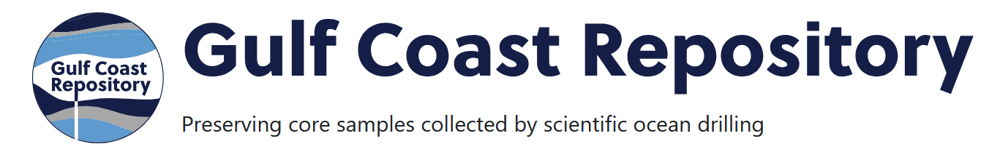

# SOD-Laboratory




This repository provides code and how-to examples for processing raw data from instrument systems owned and operated by Scientific Ocean Drilling at Texas A&M University. Many of these systems were housed on the R/V JOIDES Resolution overseen by the JOIDES Science Operator (JRSO) as part of the International Ocean Discovery Program and were shipped back to shore laboratories located at the Gulf Core Repository (GCR) in College Station, TX after the completion of the ship demobilization.

Folders are organized by laboratory. The `iodp` module contains Python code used within many of the Jupyter Notebooks. Consult the Installation section below to configure a Python environment.

# Information

- IODP website: https://iodp.tamu.edu/index.html
- i-GCR website: https://gcr.tamu.edu/. *Requests may be made to sample drill cores or measure personal samples with laboratory instrumentation using this site. Day rates are listed.*


### Instrument Systems:
- Live manuals: https://tamu-eas.atlassian.net/wiki/spaces/LMUG/overview
- Archived instrument manuals: [](https://doi.org/10.5281/zenodo.14917864)

### Data Access:

Expedition data reports and raw data:
- LORE Reports: https://web.iodp.tamu.edu/LORE/
- Proceedings Volumes: https://iodp.tamu.edu/publications/proceedings.html

Data packaged by expedition: 
- Expedition lists: https://iodp.tamu.edu/database/zenodo.html
- IODP Zenodo Community: https://zenodo.org/communities/iodp/records

### Feedback
- Send questions/requests to database@iodp.tamu.edu.


# Installation 

It is recommended to use Microsoft Visual Studio Code (VSCode) with the Jupyter Extension, however the .py scripts and notebooks should also be compatible with Jupyter Notebooks and JupyterLab. If using VSCode, review this repository's .vscode folder for the [`extensions.json`](./.vscode/extensions.json) and [`settings.json`](./.vscode/settings.json) files which specify a few VSCode configuration settings to aid development.


```shell
# ensure python is installed.
python --version

# ensure anaconda is installed
conda --version

# ensure git is installed
git --version

# create a new python virtual environment called "sod"
conda create --name sod python=3.13

# clone remote repo to local folder
git clone https://github.com/IODP/SOD-Laboratory.git

# activate virtual environment
conda activate sod

# from within the SOD-Laboratory folder:
# The iodp module must be a subfolder.
cd ./SOD-Laboratory

pip install -r iodp/requirements.txt

# pip install with the "-e" flag installs the module as an editable file location
# This helps with active development
pip install -e iodp

```

# Funding

- `NSF-OCE 2412279`: Closeout of JOIDES Resolution IODP Expedition Obligations and Operation of an Instrumented Gulf Coast Repository, US National Science Foundation. https://www.nsf.gov/awardsearch/showAward?AWD_ID=2412279

- `NSF-OCE 1326927`: Management and Operations of the JOIDES Resolution as a Facility for the International Ocean Discovery Program (IODP), US National Science Foundation. https://www.nsf.gov/awardsearch/showAward?AWD_ID=1326927

- `NSF-OCE 0352500`: System Integration Contractor for the Integrated Ocean Drilling Program, US National Science Foundation. https://www.nsf.gov/awardsearch/showAward?AWD_ID=0352500